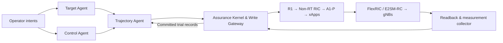

# Automating Multi-Intent RAN Orchestration through Multi-Agent Live Resolution

**Code for multi-agent intent coordination over a programmable O-RAN testbed.**

[Wookjin Lee](https://github.com/mekdugi) ·
[Jungbum Lee](https://github.com/felix9698) ·
[Gun Kim](https://github.com/imgunkim99) ·
[Seungeui Byun](https://github.com/seungeuibyun) ·
[Won Young Kang](https://github.com/dogs0667LICS) ·
Sang Hyun Lee  
School of Electrical Engineering, Korea University

[Getting started](docs/getting-started.md) ·
[Experiments](docs/experiments.md) ·
[Reproducibility](docs/reproducibility.md) ·
[Model configuration](docs/models.md) ·
[Citation](#citation)

## Overview

The framework resolves competing service intents by exploring both **acceptable
target alternatives** and **joint RAN configurations**. A Target Agent proposes
alternatives within operator-authorized bounds; a Control Agent proposes compatible
xApp configurations; a Trajectory Agent uses committed trial outcomes to select the
next experiment. A deterministic assurance layer admits actions, evaluates actual
measurements, and controls retention and recovery independently of model output.



The common evaluator checks valid observations against the authorized requirement
region, not just the model's proposed target shortlist. The runtime retains a
demonstrated configuration according to the configured retention rule and restores
the predecessor when required. Missing observations and execution errors are not
converted into evidence that a service target was violated.

### Included

- Three-agent coordination, monolithic comparison methods, and the rule-greedy
  selector, sharing trial execution and measurement interfaces.
- Assurance Kernel, execution gateway, scope-aware measurements, persistent trial
  records, and replay/analysis tools.
- Python Research Operations Cockpit for intent entry, agent configuration,
  trial inspection, safety controls, and result export.
- R1/Non-RT RIC/A1-P integration, xApp action profiles and adapters, and OAI patches.
- Hardware-free example experiments and source for the OTA campaign and analysis.
- A separate laboratory preparation utility; starting core/gNB/UE processes is not
  part of the Cockpit's policy-control path.

**Artifact scope.** This release contains the implementation and experiment tools.
The original final OTA campaign records and campaign-specific input corpus are not
included in the available source snapshot. The offline example below demonstrates
the implementation; it does **not** reproduce the paper's OTA numbers. See the
[data inventory and reproduction requirements](docs/reproducibility.md).

## Quick start — no radio hardware or API key

Target environment: **Ubuntu 22.04 LTS, Python 3.12**. A desktop display and Tk are
needed only for the GUI. Use an existing Python 3.12 installation with its matching
Tk/venv packages; Ubuntu 22.04's default Python is older.

```bash
git clone https://github.com/felix9698/multi-agent-ran-orchestration.git
cd multi-agent-ran-orchestration
python3.12 -m venv .venv
source .venv/bin/activate
python -m pip install -r requirements.txt

# Inspect the available entry points.
python main.py --help

# Run a small, explicitly MOCK three-UE experiment.
OUT="$(mktemp -d /tmp/pqc.XXXXXX)"
python tools/campaign5/run_agent_experiments.py \
  --scenario three-ue --condition contention-boundary \
  --methods three-agent --model mock:agent \
  --repetitions 1 --budget 2 --out "$OUT"
```

The example writes a manifest, episode records, metrics, and figures. Its model
responses and radio measurements are simulated. No personal inference server,
API subscription, USRP, or lab credentials are required.

To open the Cockpit:

```bash
python main.py
```

The default console starts disconnected. A live run requires your own prepared
RAN deployment and validated profile, not merely a model API key. Follow
[Getting started](docs/getting-started.md) for GUI, replay, and live prerequisites.

## Models

The agents can use external model APIs or a local inference service. The code
contains Anthropic, OpenAI, Google Gemini, Ollama, and OpenAI-compatible server
adapters. Roles may share a backend or select different models; model identifiers
and credentials belong to the user's configuration. Local-server installation,
GPU sizing, and access to the authors' infrastructure are not prerequisites for
this repository. See [Model configuration](docs/models.md).

## RAN control surface

| Scope | Registered control dimensions |
|---|---|
| UE | Serving cell, downlink PRB cap, scheduling priority |
| Cell | Downlink MCS bounds, transmit attenuation |
| Slice | Minimum/maximum/dedicated PRB ratios |

These are project control profiles mapped to O-RAN interfaces, **not a claim that
every action identifier is standardized**. Steering uses E2SM-RC Style 3 / Action 1;
the repository also implements the Style 2 / Action 6 slice mapping and explicitly
defined deployment extensions for other controls. Actual availability depends on
the installed RAN functions, compatible patches, measurement sources, and readback.
See [Control profiles](docs/control-profiles.md).

The manuscript testbed uses two gNBs and three UEs, OAI RAN/CN5G, FlexRIC, and USRP
radios. The released software does not include prebuilt OAI/FlexRIC binaries or a
ready-to-use credentialed deployment. Laboratory setup is described separately
from algorithm experiments so that offline use does not start equipment.

## Repository guide

| Path | Purpose |
|---|---|
| `assurance/coordination/` | Agents, target/control representation, preference and retention |
| `assurance/kernel/`, `assurance/gateway/` | Deterministic admission, trial lifecycle and guarded execution |
| `assurance/collector/`, `tools/liveconsole/` | Observation windows and live composition |
| `assurance/actions/`, `assurance/xapps/`, `oran/` | Control profiles, xApp coordination and O-RAN integration |
| `gui/operator/` | Research Operations Cockpit |
| `experiments/`, `tools/campaign5/` | Experiment runners, evaluators and plotting |
| `experiment_results/ota-20260911/` | OTA runner/analysis **source**, not the final measurement dataset |
| `contracts/` | Version-bound interface schemas and fixtures required by the implementation |
| `oai_patches/` | RAN/core patch sources, with separate upstream licensing |
| `tools/labctl/`, `scripts/hardware/` | Separate lab preparation and readiness utilities |
| `tests/` | Offline implementation and regression tests |

Some older-named modules and schema versions remain because current modules import
or validate against them. They are compatibility dependencies, not additional
published releases. Historical delivery archives, development logs, and Git
history are not part of this publication snapshot.

## Tests

```bash
python scripts/test_public_artifact.py
```

This runs a documented, self-contained offline suite. It does not start radios or
call a paid model service. Tests requiring unpublished campaign inputs are not
represented as passing; see [Reproducibility](docs/reproducibility.md).

## Citation

Until a final publication identifier is available, cite the software artifact:

```bibtex
@misc{lee_multi_agent_ran_orchestration_2026,
  author = {Lee, Wookjin and Lee, Jungbum and Kim, Gun and Byun, Seungeui
            and Kang, Won Young and Lee, Sang Hyun},
  title = {Automating Multi-Intent RAN Orchestration through Multi-Agent Live Resolution},
  year = {2026},
  howpublished = {Software artifact},
  url = {https://github.com/felix9698/multi-agent-ran-orchestration}
}
```

Machine-readable metadata is available in [CITATION.cff](CITATION.cff). No venue,
DOI, or publication status is inferred from the working manuscript.

## License and contact

Original project code is released under the [MIT License](LICENSE).
Third-party code, OAI-derived patches and configuration excerpts retain their
respective upstream conditions; see [THIRD_PARTY_NOTICES.md](THIRD_PARTY_NOTICES.md).

For questions about this artifact, use
[GitHub Issues](https://github.com/felix9698/multi-agent-ran-orchestration/issues).
Do not attach credentials, subscriber keys, or private deployment files.
