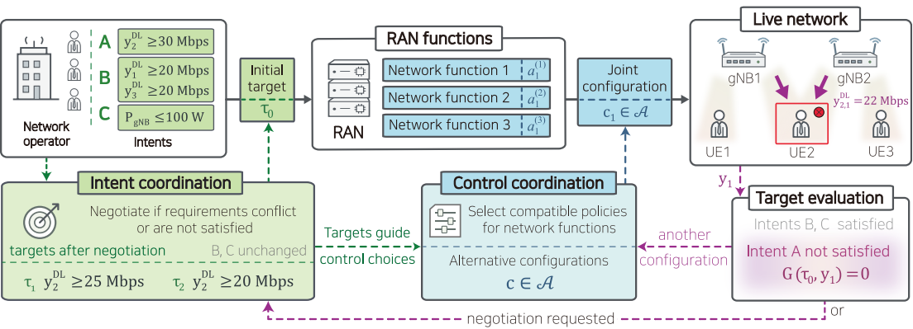
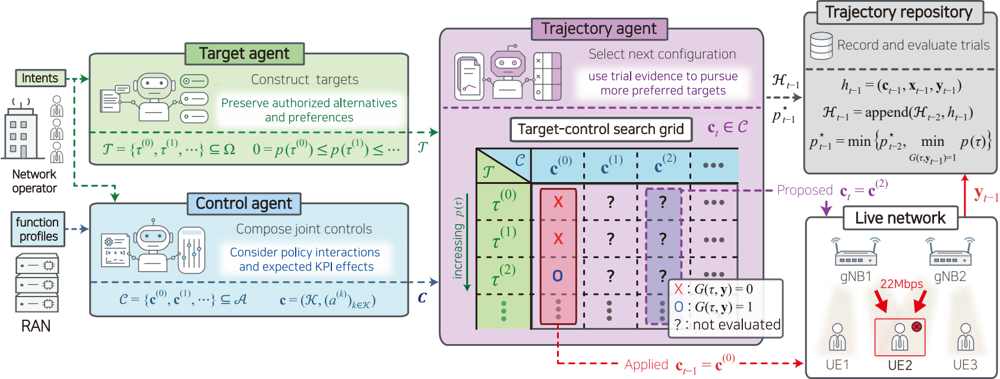
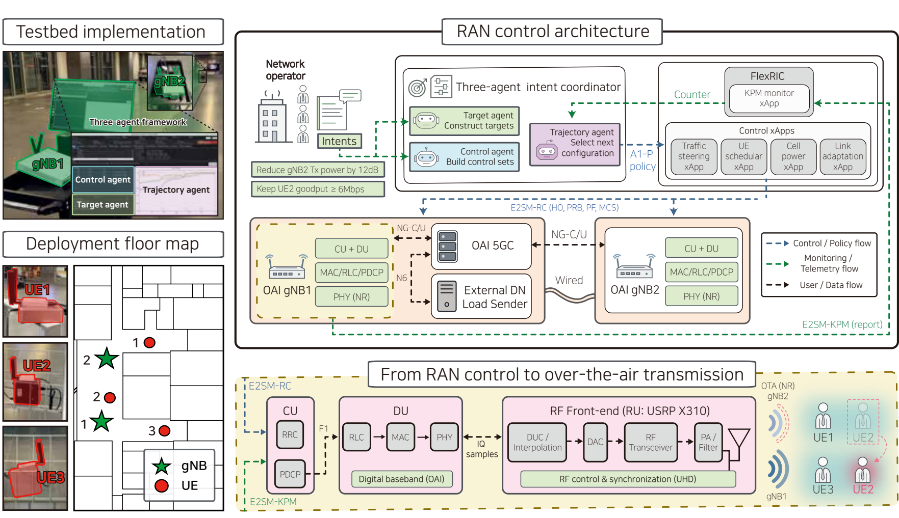
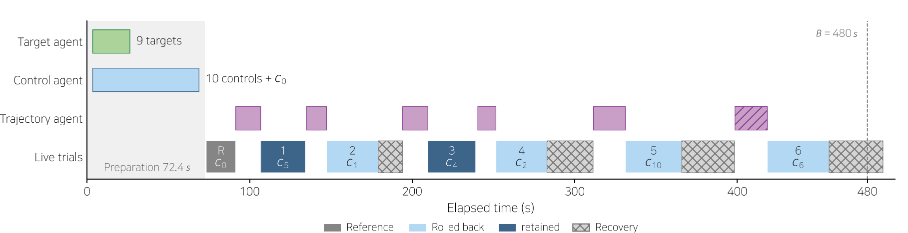
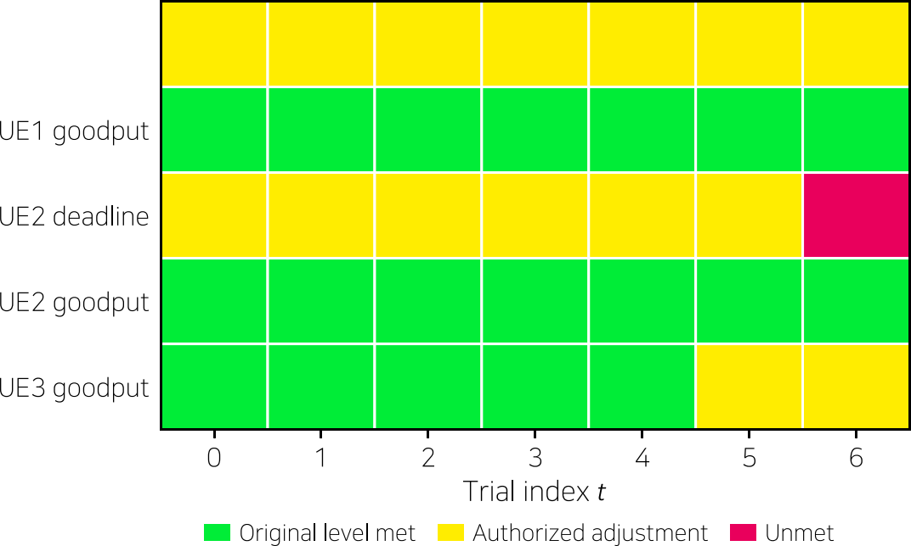
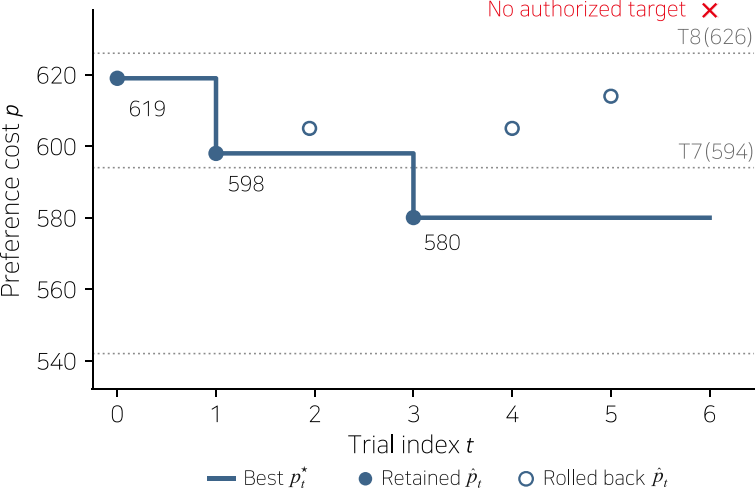
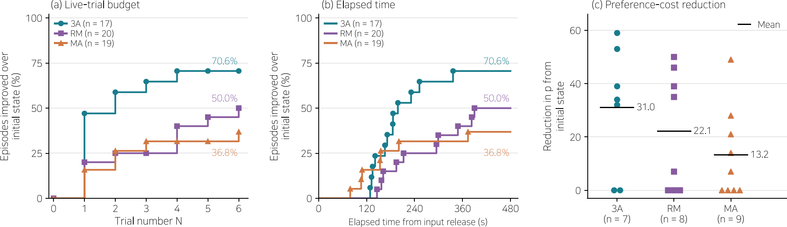
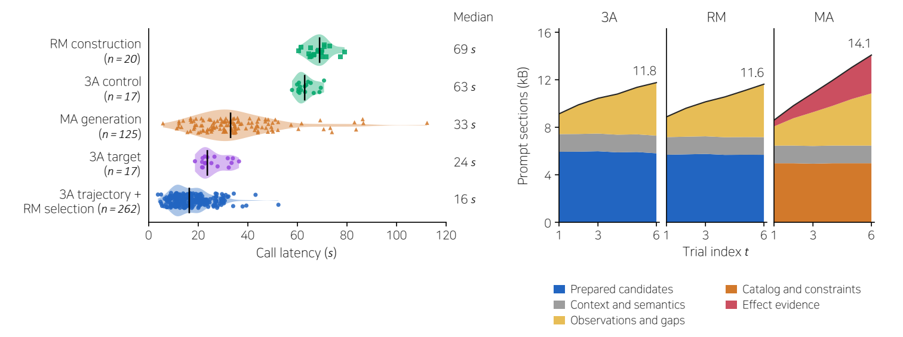

<div align="center">

# Multi-Agent RAN Orchestration

### Automating Multi-Intent RAN Orchestration through Multi-Agent Live Resolution

*Persistent service alternatives, reusable joint controls, and evidence-driven resolution over a live O-RAN testbed.*

[Wookjin Lee](https://github.com/mekdugi) ·
[Jungbum Lee](https://github.com/felix9698) ·
[Gun Kim](https://github.com/imgunkim99) ·
[Seungeui Byun](https://github.com/seungeuibyun) ·
[Won Young Kang](https://github.com/dogs0667LICS) ·
Sang Hyun Lee

School of Electrical Engineering, Korea University

[Overview](#1-overview) · [Framework](#2-three-agent-live-resolution) ·
[Testbed](#3-end-to-end-o-ran-testbed) · [Results](#4-experimental-evaluation) ·
[Quick start](#5-getting-started) · [Citation](#8-citation-and-license)

</div>

> **Paper:** Wookjin Lee, Jungbum Lee, Gun Kim, Seungeui Byun, Won Young Kang, and
> Sang Hyun Lee, *“Automating Multi-Intent RAN Orchestration through Multi-Agent
> Live Resolution,”* submitted manuscript, 2026.
>
> **Key result:** In the reported 5G standalone OTA experiments, the three-agent
> method improves the initial service state in **71% of episodes within six
> additional live trials**, compared with **50%** for role-merged reasoning and
> **37%** for direct configuration generation.

This repository contains the agent coordinator, deterministic assurance and
execution layers, O-RAN control integration, Research Operations Cockpit, and
experiment/analysis tools. The figures below are reproduced from the submitted
manuscript.

---

## 1. Overview

Multiple service intents share radio resources and interact through the controls
used to realize them. A configuration that helps one UE may impair another, and
an unsuccessful trial does not establish that the original service target is
infeasible. The framework explores **both authorized service alternatives and
compatible joint RAN configurations**, using physical-network observations to
guide subsequent actions.

1. **Persistent resolution space.** Operator-authorized targets and reusable
   joint controls remain available instead of being reconstructed after every trial.
2. **Role-separated reasoning.** Target and Control agents prepare alternatives;
   a Trajectory agent selects subsequent configurations from current context and
   accumulated execution evidence.
3. **Bounded live interaction.** Deterministic validation, readback, KPI windows,
   and verified recovery connect agent proposals to the RAN. Reaching an acceptable
   state can support further exploration toward a more preferred authorized target.

<p align="center">
  <a href="assets/figures/fig1.pdf"></a>
</p>

*Fig. 1. Coupled intent and control coordination. The numerical requirements
illustrate the formulation, not the OTA campaign settings below.*

## 2. Three-agent live resolution

| Role | Responsibility | Episode output |
|---|---|---|
| **Target agent** | Organize original requirements and authorized adjustments by preference. | Target candidates **T**, within the full authorized space **Ω**. |
| **Control agent** | Compose RAN-function policies using capabilities, dependencies, and expected effects. | Reusable, compatible joint-control candidates **C**. |
| **Trajectory agent** | Relate current context to recorded outcomes and remaining service gaps. | The next applicable, untried configuration. |

<p align="center">
  <a href="assets/figures/fig2.pdf"></a>
</p>

*Fig. 2. Proposed three-agent framework for live target-control resolution.*

Target and Control preparation runs in parallel. **T** and **C** then remain fixed
while the execution history grows. Proposals pass deterministic action-space and
compatibility checks; readback confirms their application before KPI collection.

Valid observations are assessed against **all authorized targets in Ω**, not only
the shortlist **T**. A configuration is retained when its demonstrated preference
cost is no worse than the previous best; otherwise, the gateway restores and
verifies the preceding baseline. Recovery preserves the trial's evidence.
Incomplete observations are not treated as valid evidence of target failure.

## 3. End-to-end O-RAN testbed

The Cockpit and coordinator connect through R1, the Non-RT RIC, A1-P, and control
xApps to FlexRIC and the gNBs via E2SM-RC. Agents coordinate xApp policies above
the near-real-time loop rather than replacing scheduler logic. KPM telemetry,
O1 reports, configuration readback, and user-plane measurements provide the return
path, preserving measurement scopes and timestamps.

<p align="center">
  <a href="assets/figures/fig3.pdf"></a>
</p>

*Fig. 3. End-to-end implementation and physical deployment.*

### Hardware and radio configuration

| Hosts | Components | Processor / memory | RF front end |
|---|---|---|---|
| PC1 | gNB1, OAI CN5G, control services, Cockpit | AMD Ryzen 7 8700G / 32 GB | NI USRP-2954R |
| PC2 | gNB2 | AMD Ryzen 7 8700G / 32 GB | NI USRP-2974 |
| PC3–5 | UE1–3 | AMD Ryzen 7 H 255 / 16 GB each | NI USRP-B206mini-i each |

All hosts run **Ubuntu 22.04 LTS**, with OAI gNB/NR-UE stacks and OAI CN5G.
Both cells use **n78, 30-kHz subcarrier spacing, 38 PRBs, and 15-MHz channels**,
centered at 3349.92 MHz and 3319.68 MHz. The gNBs are 50 m apart in the indoor
deployment. UEs remain stationary; serving-cell changes result from applied controls.

### Registered controls

| Scope | Control dimensions | Execution mapping |
|---|---|---|
| UE | Serving cell | E2SM-RC Style 3 / Action 1 |
| UE | Downlink PRB cap; PF scheduling weight | Deployment-specific Style 2 / Actions 102–103 |
| Cell | MCS bounds; transmit attenuation | Deployment-specific Style 2 / Actions 101 and 104 |
| Slice | Minimum, maximum, and dedicated PRB ratios | Style 2 / Action 6 slice-quota mapping |

Standard E2SM-RC operations are combined with explicitly defined deployment
extensions, not presented as universally standardized action identifiers. The
reported evaluation exercises serving-cell selection, UE PRB caps, PF weights,
and gNB1 transmit attenuation. See [Control profiles](docs/control-profiles.md)
for the broader registered repertoire and implementation boundaries.

## 4. Experimental evaluation

### Setup and compared methods

Five simultaneous requirements cover the three UEs' downlink goodput, UE2 deadline
satisfaction, and gNB1 transmit attenuation. UE2 and UE3 initially share gNB1;
UE1 starts on gNB2. Each UE receives a 10-Mbps downlink offered load. UE2's
goodput floor is protected; four other requirements permit authorized adjustments.

| Setting | Reported experiment |
|---|---|
| Campaign | 17 blocks; **56 episodes**, including episodes from restarted blocks |
| Trial budget | Reference trial 0, followed by at most **6 additional live trials** |
| Time budget | **480 s** from input release, including preparation, decisions, execution, and recovery |
| KPI window | **15 s** per trial |
| Deadline traffic | 256-byte tagged UDP echo at 5 Hz; **35-ms** deadline |
| Authorized targets | 21 levels per adjustable requirement: **21⁴ targets** |
| Reported model | `claude-5.5-sonnet` through Anthropic Messages API |
| Response limits | 4,000 tokens for candidate construction; 2,000 for online selection/generation |

A trial dispatched before the time limit completes observation and any recovery.
All methods share authorization, available controls, measurement rules, validation,
and recovery. The software supports other model backends, but those choices
constitute new experiments rather than the reported model setting.

| Method | Candidate preparation | Live interaction | Code identifier |
|---|---|---|---|
| **3A — Three-agent** | Independently construct **T** and **C** in parallel. | Trajectory selects from persistent candidates using accumulated evidence. | `three-agent` |
| **RM — Role-merged** | Construct both **T** and **C** in one model call. | Same selection instructions and input format as 3A. | `internal-monolith` |
| **MA — Monolithic** | No reusable candidate sets. | Generate a complete joint configuration at each trial. | `basic-monolith` |

### 4.1 Resolution through successive live trials

<p align="center">
  <a href="assets/figures/fig4a.pdf"></a>
</p>

<table>
  <tr>
    <td width="57%"><a href="assets/figures/fig4b.pdf"></a></td>
    <td width="43%"><a href="assets/figures/fig4c.pdf"></a></td>
  </tr>
</table>

*Fig. 4. A 3A episode: (a) preparation and execution, (b) requirement outcomes,
and (c) individual-trial and best demonstrated preference costs.*

Preparation takes **72.4 s**, producing nine targets and ten new controls plus the
reference configuration. Trial 1 adjusts UE2's PF weight; trial 3 combines a
further PF adjustment with gNB1 transmit attenuation. The best cost decreases
**619 → 598 → 580**. Poorer trials trigger recovery without erasing the history,
and trial 5 demonstrates an authorized target outside the prepared shortlist.

### 4.2 Service improvement within the live budget

<p align="center">
  <a href="assets/figures/fig5.pdf"></a>
</p>

*Fig. 5. Improvement over the initial observation: (a) additional trials,
(b) elapsed time, and (c) preference-cost reduction.*

| Method | Episodes | Improved after the first additional trial | Improved within six additional trials |
|---|---:|---:|---:|
| **3A** | 17 | **47.1%** | **70.6% (12/17)** |
| **RM** | 20 | 20.0% | 50.0% (10/20) |
| **MA** | 19 | 15.8% | 36.8% (7/19) |

Improvement means at least a 21-point cost reduction when the reference already
demonstrates an authorized target; otherwise, the first valid target attainment
counts. The six-trial figures round to **71%, 50%, and 37%**. MA records earlier
initial improvements without candidate preparation; 3A overtakes its improvement
fraction at **135 s** and reaches 71% by the common 480-s horizon.

For episodes already demonstrating an authorized target at the reference, mean
cost reductions are **31.0 for 3A**, **22.1 for RM**, and **13.2 for MA**
(7, 8, and 9 episodes, respectively). An acceptable starting state therefore need
not end resolution toward more preferred service outcomes.

### 4.3 Inference cost of candidate reuse

<p align="center">
  <a href="assets/figures/fig6.pdf"></a>
</p>

*Fig. 6. Inference cost of candidate preparation and reuse: (a) latency and
(b) prompt composition.*

Across **441 model calls**, median latency is **24 s** for 3A target preparation,
**63 s** for 3A control preparation, and **69 s** for RM's joint construction.
The two 3A preparation calls run in parallel. Recurring 3A/RM selection has a
pooled median of **16 s**, versus **33 s** for MA's direct generation. Under the
2,000-token limit, **3/262 selection calls** reach the limit versus **37/125 MA
calls**. Candidate reuse shifts recurring reasoning from reconstructing controls
to selecting among existing alternatives using new live evidence.

## 5. Getting started

### Offline example — no radio hardware or API key

Use **Ubuntu 22.04 LTS and Python 3.12**. The GUI additionally needs a display and
the matching Tk package. Ubuntu 22.04's default Python is older.

```bash
git clone https://github.com/felix9698/multi-agent-ran-orchestration.git
cd multi-agent-ran-orchestration
python3.12 -m venv .venv
source .venv/bin/activate
python -m pip install -r requirements.txt

python scripts/test_public_artifact.py

OUT="$(mktemp -d /tmp/pqc.XXXXXX)"
python tools/campaign5/run_agent_experiments.py \
  --scenario three-ue --condition contention-boundary \
  --methods three-agent --model mock:agent \
  --repetitions 1 --budget 2 --out "$OUT"
```

The example writes a manifest, episodes, metrics, and figures using a mock model
backend. It demonstrates the end-to-end pipeline and does not reproduce the OTA
results above.
See [Reproducibility](docs/reproducibility.md) for metric rederivation and test scope.

### Cockpit and model selection

```bash
python main.py
```

The Cockpit starts disconnected and provides intent entry, role-specific model
selection, target/control exploration, trial and safety views, an evidence ledger,
batch experiments, and result export. Live use requires a prepared testbed and
validated deployment profile. A separate lab-preparation utility manages equipment
outside the Cockpit's policy-control path.

Adapters support Anthropic, OpenAI, Google Gemini, Ollama, and OpenAI-compatible
inference services. Agents may share a backend or use different models. Supply
your own credentials and endpoints; the authors' local server is not required.

- [Installation, GUI operation, and live prerequisites](docs/getting-started.md)
- [Model configuration and role selection](docs/models.md)
- [Method mapping and experiment tools](docs/experiments.md)

## 6. Repository guide

| Path | Contents |
|---|---|
| [`assurance/coordination/`](assurance/coordination/) | Agents, candidates, preference evaluation, and retention |
| [`assurance/kernel/`](assurance/kernel/), [`assurance/gateway/`](assurance/gateway/) | Deterministic admission, bounded trials, readback, and recovery |
| [`assurance/collector/`](assurance/collector/), [`tools/liveconsole/`](tools/liveconsole/) | Observation windows, service measurements, and live composition |
| [`assurance/actions/`](assurance/actions/), [`assurance/xapps/`](assurance/xapps/), [`oran/`](oran/) | Controls, composition constraints, and O-RAN integration |
| [`gui/operator/`](gui/operator/) | Research Operations Cockpit |
| [`experiments/`](experiments/), [`tools/campaign5/`](tools/campaign5/) | Experiment runners, metrics, and plots |
| [`experiment_results/ota-20260911/`](experiment_results/ota-20260911/) | OTA campaign configuration and analysis scripts |
| [`contracts/`](contracts/), [`oai_patches/`](oai_patches/) | Interface schemas, fixtures, and RAN patches |
| [`tools/labctl/`](tools/labctl/), [`scripts/hardware/`](scripts/hardware/) | Separate lab preparation and readiness utilities |
| [`tests/`](tests/) | Implementation and regression tests |
| [`assets/figures/`](assets/figures/) | Manuscript figure PDFs and README previews |

## 7. Figures and data availability

Click any figure to open its vector PDF. All eight figure files, including the
three panels of Fig. 4, are available in [the figure directory](assets/figures/README.md).
The values reported above are taken from the manuscript.

This release provides the complete execution and analysis code. Raw episode records
from the reported OTA campaign are not included in the repository; the
[data inventory](docs/reproducibility.md#data-availability-and-limits) describes the
inputs required to regenerate the reported metrics.

## 8. Citation and license

The accompanying manuscript is currently under review. If you use this software
artifact, please cite:

```bibtex
@misc{lee_multi_agent_ran_orchestration_2026,
  author = {Lee, Wookjin and Lee, Jungbum and Kim, Gun and Byun, Seungeui
            and Kang, Won Young and Lee, Sang Hyun},
  title = {Automating Multi-Intent RAN Orchestration through Multi-Agent Live Resolution},
  year = {2026},
  howpublished = {Software artifact accompanying a submitted manuscript},
  url = {https://github.com/felix9698/multi-agent-ran-orchestration}
}
```

See [CITATION.cff](CITATION.cff) for machine-readable metadata. Original project
code uses the [MIT License](LICENSE); third-party code and OAI-derived patches
retain the conditions described in [Third-party notices](THIRD_PARTY_NOTICES.md).

Questions are welcome through
[GitHub Issues](https://github.com/felix9698/multi-agent-ran-orchestration/issues).
Please do not attach credentials or private deployment files.
